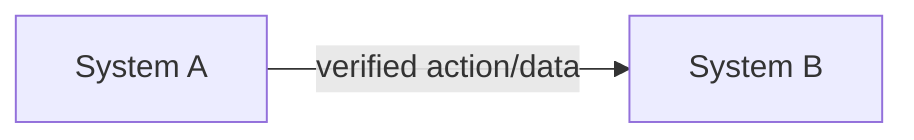

# System Diagrammer

Use this skill when the user needs a slow code-backed walkthrough and diagram explaining how systems, data, workflows, services, teams, tools, APIs, queues, databases, jobs, or integrations connect.

Default stance: a diagram is a claim. Do not draw final edges until evidence supports them.

## Success Criteria

- Every important node and edge has evidence, an owner/source, or is marked as an assumption.
- The diagram exposes direction, trigger, data shape, protocol, timing, storage, retries, and failure behavior where relevant.
- Disconnects, ambiguous ownership, missing handoffs, edge cases, and breakpoints are called out explicitly.
- Findings are recorded as the code is walked, with severity, evidence, and recommended fixes.
- The output is useful for debugging, not just presentation.

## Workflow

1. Define scope.
   - Identify the system boundary, user/workflow being traced, start event, end state, and level of detail needed.
   - Ask one targeted question if the boundary or expected output is unclear.
   - Prefer a narrow verified diagram over a broad speculative one.
2. Gather evidence slowly.
   - Read docs, source code, configs, manifests, runbooks, env examples, CI/deploy files, API schemas, database migrations, logs, tests, queue/job definitions, dashboards, and issue history as available.
   - For codebases, walk all relevant code deliberately: entrypoints, routes, handlers, domain services, clients/adapters, jobs, events, persistence, auth, config, tests, and deployment wiring.
   - Use repository search and file lists to avoid missing hidden paths. If a full walk is impractical, state the sampling strategy before relying on it.
   - Follow real entrypoints and callers before drawing shared utilities or inferred dependencies.
   - Keep a running findings log with file paths, line references when useful, evidence, impact, and likely fix.
   - For external systems, separate verified contracts from names mentioned in prose.
3. Build an inventory.
   - List systems, actors, stores, interfaces, messages, jobs, events, secrets, network boundaries, and ownership.
   - Mark each item as `Verified`, `Inferred`, `Assumed`, `Missing`, or `Contradicted`.
4. Connect one edge at a time.
   - For each connection, capture: source, target, trigger, direction, payload/data, protocol, auth, timing, retry/idempotency behavior, failure path, and evidence.
   - If any of those are unknown, keep the edge but label the unknown explicitly.
   - Do not collapse multiple hops into one arrow when an intermediate system can fail or transform data.
5. Debug the map.
   - Hunt for breaks: missing producers/consumers, one-way writes with no reader, read paths with no writer, unhandled retries, circular dependencies, manual handoffs, stale docs, orphaned config, unowned data, schema drift, hidden cron jobs, race conditions, and missing observability.
   - Check edge cases: duplicate events, delayed delivery, partial failure, rollback, backfill, deletion, auth expiry, rate limits, malformed payloads, empty state, replay, and out-of-order processing.
   - Where possible, run targeted commands/tests or inspect runtime evidence to verify disputed edges.
6. Produce diagrams.
   - Use Mermaid by default because it is text-reviewable.
   - Pick the smallest diagram type that fits:
     - `flowchart` for system/data movement and dependencies.
     - `sequenceDiagram` for request/event timing.
     - `stateDiagram-v2` for lifecycle and status transitions.
     - `erDiagram` for data ownership and relationships.
   - Split large maps into context, detailed workflow, and failure-path diagrams instead of making one unreadable diagram.
7. Report verification.
   - Include an evidence table and an uncertainty list.
   - Lead with disconnects and breakpoints when the task is diagnostic.
   - Provide concrete fix recommendations for each meaningful finding, ordered by impact and dependency.
   - State what was not verified and why.

## Output Format

````markdown
## System Diagram

Scope: boundary, start event, end state
Confidence: High | Medium | Low



### Evidence

| Connection | Status | Evidence | Notes |
| --- | --- | --- | --- |
| A -> B | Verified/Inferred/Assumed/Missing/Contradicted | File, command, log, doc, or observation | Trigger, payload, failure behavior |

### Breaks and Edge Cases

1. Issue or risk
   - Evidence:
   - Impact:
   - Debug/verification step:
   - Recommended fix:

### Findings

| Severity | Finding | Evidence | Recommendation |
| --- | --- | --- | --- |
| High/Medium/Low | What is broken, risky, or unclear | File, command, log, doc, or observation | Specific fix or next verification step |

### Open Questions

- Question blocking higher confidence.

### Verification Performed

```bash
commands or checks run
```

### Limits

- Anything not inspected, unavailable, or still assumed.
````

## Guardrails

- Do not make diagrams from memory when project evidence is available.
- Do not hide unknowns inside clean arrows.
- Do not treat docs, comments, or names as proof; verify against code, config, runtime, or contracts when possible.
- Do not over-diagram. If the user needs debugging, prioritize the path that can break.
- Do not skip code traversal silently. If a file area, integration, or runtime path was not walked, list it in `Limits`.
- Do not give vague recommendations. Tie each recommendation to a finding and evidence.
- Do not create vendor-biased labels or recommendations. Use neutral system names and technical evidence.
- Do not credit any AI for generated diagrams or analysis.
